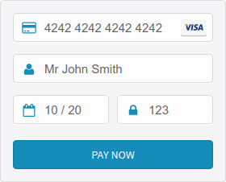

# CardJs

A simple, clean, credit card form for your website. Includes number formatting, validation and automatic card type detection.



[View working example >](https://cardjs.co.uk/)


# Installation

- Bower: `bower install card-js --save`
- NPM: `npm install card-js`
- Zip: [Download](https://github.com/CardJs/CardJs/archive/master.zip)

You will need to include both `card-js.min.js` and `card-js.min.css` into your web page.


# Usage

For working examples of using CardJs, see the [examples](examples) folder of this project.

## Automatic Insertion
Any elements with the class `card-js` will be automatically converted into a basic credit card input with the expiry date and CVC check.

The easiest way to get started with CardJs is to insert the snippet of code:
```html
<div class="card-js"></div>
```

## Manual Insertion

If you wish to manually alter the fields used by CardJs to add additional classes or set the input field name or id etc,
you can pre-populate the form fields as show below.

```html
<div class="card-js">
  <input class="card-number my-custom-class" name="card-number">
  <input class="name" id="the-card-name-id" name="card-holders-name" placeholder="Name on card">
  <input class="expiry-month" name="expiry-month">
  <input class="expiry-year" name="expiry-year">
  <input class="cvc" name="cvc">
</div>
```


# Reading Values

CardJs provides functionality allowing you to read the form field values directly with JavaScript. This can be useful if
you wish to submit the values via Ajax.

Create a CardJs element and give it a unique id (in this example `my-card`)

```html
<div class="card-js" id="my-card" data-capture-name="true"></div>
```

The javascript below demonstrates how to read each value of the form into local variables.

```javascript
var myCard = $('#my-card');

var cardNumber = myCard.CardJs('cardNumber');
var cardType = myCard.CardJs('cardType');
var name = myCard.CardJs('name');
var expiryMonth = myCard.CardJs('expiryMonth');
var expiryYear = myCard.CardJs('expiryYear');
var cvc = myCard.CardJs('cvc');
```


# Functions

To call a function on a CardJs element, follow the pattern below.
Replace the text 'function' with the name of the function you wish to call.

```javascript
$('#my-card').CardJs('function')
```

The functions available are listed below:

| Function    | Description                                    |
| :---------- | :--------------------------------------------- |
| cardNumber  | Get the card number entered                    |
| cardType    | Get the type of the card number entered        |
| name        | Get the name entered                           |
| expiryMonth | Get the expiry month entered                   |
| expiryYear  | Get the expiry year entered                    |
| cvc         | Get the CVC entered                            |


## CardType Function

The `cardType` function will return one of the following strings based on the card number entered.
If the card type cannot be determined an empty string will be given instead.

| Card Type              |
| :--------------------- |
| AMEX                   |
| Diners                 |
| Diners - Carte Blanche |
| Discover               |
| JCB                    |
| Mastercard             |
| Visa                   |
| Visa Electron          |


# Static functions

If you just want to perform simple operations without the CardJs form, there are a number of static functions provided
by the CardJs library that are made available.


## Card Type from Card Number
```javascript
var cardNumber = '4242 4242 4242 4242'; // Spacing is not important
var cardType = CardJs.cardTypeFromNumber(cardNumber);
```

## Cleaning and Masking
```javascript
// var formatMask = 'XXXX XXXX XXXX XXXX'; // You can manually define an input mask
// var formatMask = 'XX+X X XXXX XXXX XXXX'; // You can add characters other than spaces to the mask
var formatMask = CardJs.CREDIT_CARD_NUMBER_VISA_MASK; // Or use a standard mask.
var cardNumber = '424 2424242 42   42 42';
var cardNumberWithoutSpaces = CardJs.numbersOnlyString(cardNumber);
var formattedCardNumber = CardJs.applyFormatMask(cardNumberWithoutSpaces, formatMask);
```

### Masks

| Variable Name                             | Mask
| :---------------------------------------- | :------------------ |
| CardJs.CREDIT_CARD_NUMBER_DEFAULT_MASK    | XXXX XXXX XXXX XXXX |
| CardJs.CREDIT_CARD_NUMBER_VISA_MASK       | XXXX XXXX XXXX XXXX |
| CardJs.CREDIT_CARD_NUMBER_MASTERCARD_MASK | XXXX XXXX XXXX XXXX |
| CardJs.CREDIT_CARD_NUMBER_DISCOVER_MASK   | XXXX XXXX XXXX XXXX |
| CardJs.CREDIT_CARD_NUMBER_JCB_MASK        | XXXX XXXX XXXX XXXX |
| CardJs.CREDIT_CARD_NUMBER_AMEX_MASK       | XXXX XXXXXX XXXXX   |
| CardJs.CREDIT_CARD_NUMBER_DINERS_MASK     | XXXX XXXX XXXX XX   |


# Card Expiry Validation
The expiry month can be in the range: 1 = January to 12 = December

```javascript
var month = 3;
var year = 2019;
var valid = CardJs.isExpiryValid(month, year);
```

The expiry month and year can be either and integer or a string.
```javascript
var month = "3";
var year = "2019";
var valid = CardJs.isExpiryValid(month, year);
```

The expiry year can be either 4 digits or 2 digits long.
```javascript
var month = "3";
var year = "19";
var valid = CardJs.isExpiryValid(month, year);
```


# License

CardJs is released under the MIT license. [View license](https://github.com/CardJs/CardJs/blob/master/LICENSE.md)